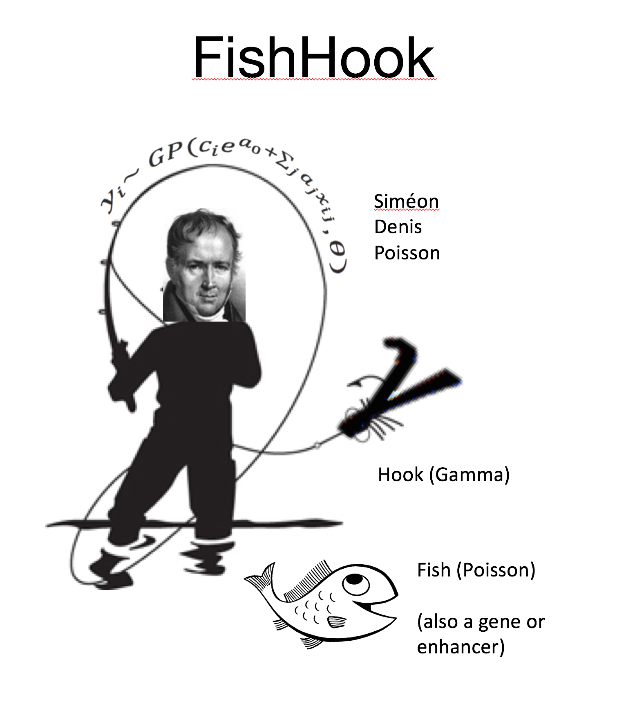
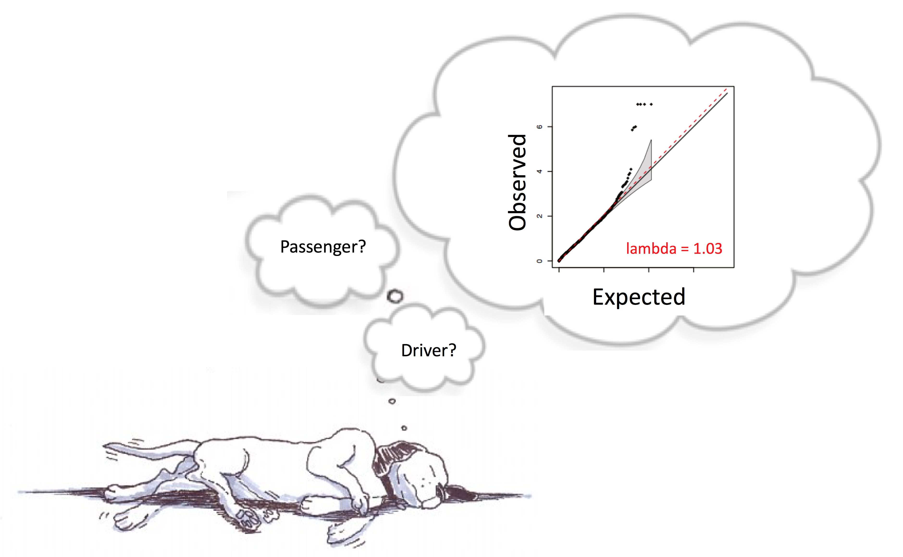
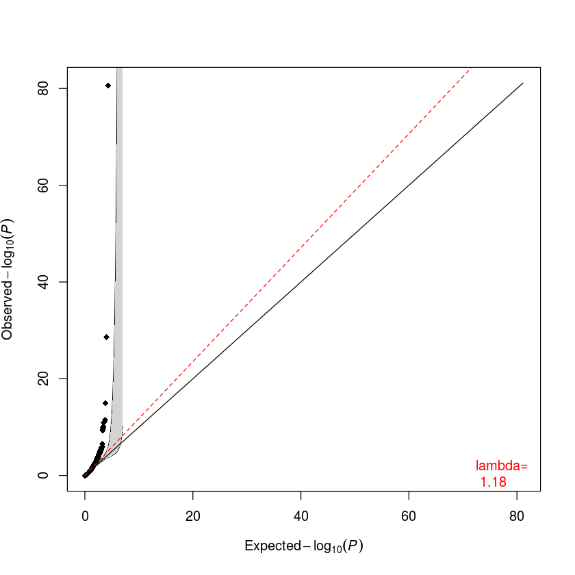
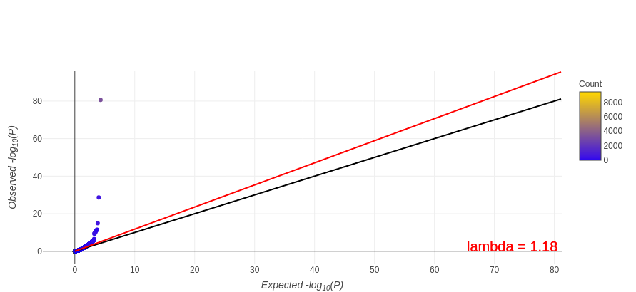
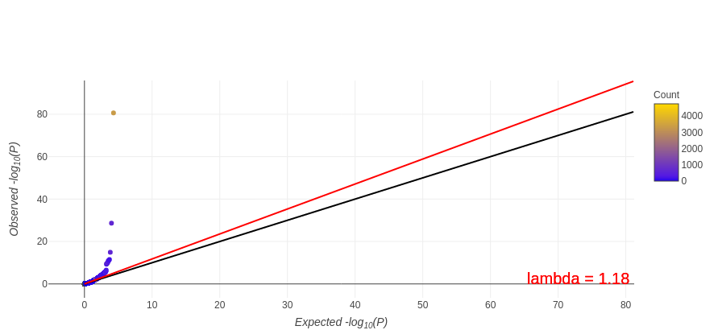

[](https://travis-ci.org/mskilab/fishHook)
[](https://codecov.io/github/mskilab/fishHook?branch=master)




fishHook
======

R package for applying Gamma-Poisson regression to identify statistical
enrichment or depletion of somatic mutations in arbitrary (sets of) genomic
intervals after correcting for genomic  covariates, e.g. replication timing,
sequence context, chromatin state.

[](http://www.gnu.org/licenses/gpl-3.0)

# Table of Contents:
-----------
1. [Installation](#installation)
2. [R Documentation](#rdocs)
3. [Attributions](#attributions)
4. [TL;DR](#tldr)
5. [FishHook Demo](#demo)
6. [FishHook Operations](#fishhook_ops)
7. [Active Bindings and FishHook Variables](#active_bindings)
7. [FishHook Functions](#functions)

<div id="installation"/>

Installation 
-----------

1. Install devtools from CRAN (if you don't have it already)

  ```
  install.packages('devtools')
  ```

2. Install gUtils 

  ```
  devtools::install_github('mskilab/gUtils')
  ````


3. Install ffTrack

  ```
  devtools::install_github('mskilab/ffTrack')
  ````

4. Install fishHook

  ```
  devtools::install_github('mskilab/fishHook')
  ````


<p align="center">

</p>

<div id="rdocs"/>

See Documentation 
------------
[R Documentation](https://raw.githubusercontent.com/mskilab/fishHook/master/fishHook.pdf)


<div id="attributions"/>

Attributions
------------
> Marcin Imielinski - Assistant Professor, Weill-Cornell Medical College. Core Member, New York Genome Center.


<div id="tldr"/>


TL;DR
-----------


### Load the fishHook Package


```R
library(fishHook)
```

###  Load in Your Data
**mutational_events** is a GRanges containing mutations (e.g. snvs/indels or SCNAs)

**targets** is a GRanges containing the start and ends of each gene and some metadata.
This can be other 'targets' such as 1kb tiles of the genome

**eligible** is a GRanges indicating which regions of the genome are captured in our assay (whole exome sequencing)
This can be replace with an array/whole genome sequencing specific track.

**covariate** is a GRanges of replication timing across the genome. This can be replaced with other covariates
such as H3K9me3 profile, chromhmm intervals, etc.


```R
data(events)
data(targets)
data(eligible)
data(replication_timing)
```

### Create a Covariate Object


```R
cov = Cov(data = replication_timing, name = 'rept', type = 'numeric', field = 'score')
```

### Instantiate The FishHook object


```R
fish = Fish(hypotheses = gene_targets, events = mutational_events, eligible = eligible, covariates = cov)
fish
```


### Fit a Gamma Poisson Model of Background Mutational Density and Covariates and Score Your Hypotheses


```R
fish$score()
fish
```

### Statistical Validation of Results with QQ-Plots


```R
plot <- fish$qqp(plotly = F)
```


<div id="demo"/>


Demo
-----------


### Load the Required Packages


```R
library(fishHook)
```

### Now we will need some data
fishHook utilizes Gamma-Poisson regression to nominate regions enriched in mutation from sequencing and/or microarray data. To do this we take a set of genomic targets, and test each one against the hypothesis that they have a background level of mutational burden. In this first example we use genes as our targets and exome data as the mutational events. Since exome sequencing tends to exhibit strong sequencing bias, we to include this information in our analysis by indicating sufficiently covered regions in the variable eligible.


Events = mutations

```R
events

```


    GRanges object with 1985704 ranges and 1 metadata column:
                seqnames                 ranges strand   | patient_code
                   <Rle>              <IRanges>  <Rle>   |  <character>
            [1]       10   [52587953, 52587953]      *   | TCGA-D8-A1J8
            [2]       10   [52595854, 52595854]      *   | TCGA-BH-A0HP
            [3]       10   [52595854, 52595854]      *   | TCGA-BH-A0HP
            [4]       10   [52595937, 52595937]      *   | TCGA-BH-A18P
            [5]       10   [52596055, 52596055]      *   | TCGA-AC-A2FB
            ...      ...                    ...    ... ...          ...
      [1985700]       22 [ 39239549,  39239549]      *   | TCGA-ZN-A9VW
      [1985701]       22 [ 50720356,  50720356]      *   | TCGA-ZN-A9VW
      [1985702]        X [ 83362035,  83362035]      *   | TCGA-ZN-A9VW
      [1985703]        X [110005955, 110005955]      *   | TCGA-ZN-A9VW
      [1985704]        X [153588774, 153588774]      *   | TCGA-ZN-A9VW
      -------
      seqinfo: 23 sequences from an unspecified genome; no seqlengths


### Gene Targets 

Our hypotheses are stored in a GRanges object called "targets", Hypotheses are 
regions of the genome that we are testing for mutational enrichment above
background (i.e. positive selection). In this case "targets" contains genes. 

However, any GRanges can serve as a hypothesis set, e.g. a set of enhancers or 
non-overlapping tiles of the genome. 


```R
targets
```


    GRanges object with 19688 ranges and 1 metadata column:
              seqnames                 ranges strand   |    gene_name
                 <Rle>              <IRanges>  <Rle>   |  <character>
          [1]       19   [58856544, 58864865]      -   |         A1BG
          [2]       10   [52559169, 52645435]      -   |         A1CF
          [3]       12   [ 9220260,  9268825]      -   |          A2M
          [4]       12   [ 8975068,  9039597]      +   |        A2ML1
          [5]        1   [33772367, 33786699]      -   |      A3GALT2
          ...      ...                    ...    ... ...          ...
      [19684]        7 [143078173, 143088204]      +   |          ZYX
      [19685]       17 [  3907739,   4046314]      -   |        ZZEF1
      [19686]        1 [ 78028101,  78149104]      -   |         ZZZ3
      [19687]       19 [ 14183348,  14185874]      +   | hsa-mir-1199
      [19688]       19 [ 50003781,  50004614]      +   |  hsa-mir-150
      -------
      seqinfo: 25 sequences from an unspecified genome; no seqlengths


### Eligible


```R
data(eligible)
eligible
```


    GRanges object with 2329621 ranges and 1 metadata column:
                seqnames                 ranges strand   |     score
                   <Rle>              <IRanges>  <Rle>   | <numeric>
            [1]        1       [861300, 861310]      *   |      0.84
            [2]        1       [861311, 861367]      *   |      0.85
            [3]        1       [861368, 861386]      *   |      0.84
            [4]        1       [861387, 861395]      *   |      0.83
            [5]        1       [866417, 866420]      *   |      0.95
            ...      ...                    ...    ... ...       ...
      [2329617]        X [155239804, 155239804]      *   |      0.88
      [2329618]        X [155239805, 155239805]      *   |      0.86
      [2329619]        X [155239806, 155239806]      *   |      0.85
      [2329620]        X [155239807, 155239807]      *   |      0.83
      [2329621]        X [155239808, 155239808]      *   |      0.82
      -------
      seqinfo: 25 sequences from an unspecified genome


### The FishHook Object
All of the data manipulations are handled by the fishHook object. You can initialize it as follows. 


```R
fish = FishHook$new(targets = gene_targets, events = mutational_events, eligible = eligible)
fish
```


    Contains 19688 hypotheses.
    Contains 1985704 events to map to hypotheses.
    Will map only eligible regions.
    Covariates:
    No covariates will be used.
    Targets contains 2 metadata columns
    Current State: Initialized
    


### Points about the FishHook Object
The FishHook object will take various states during our analysis. You can view the current state from the print output of the fish object or by accessing it directly via fish$state.
All provided variables can be accessed in this manner.


```R
fish$state
fish$targets
fish$events
fish$eligible
```


    Initialized


    GRanges object with 19688 ranges and 2 metadata columns:
              seqnames                 ranges strand   |    gene_name      name
                 <Rle>              <IRanges>  <Rle>   |  <character> <integer>
          [1]       19   [58856544, 58864865]      -   |         A1BG         1
          [2]       10   [52559169, 52645435]      -   |         A1CF         2
          [3]       12   [ 9220260,  9268825]      -   |          A2M         3
          [4]       12   [ 8975068,  9039597]      +   |        A2ML1         4
          [5]        1   [33772367, 33786699]      -   |      A3GALT2         5
          ...      ...                    ...    ... ...          ...       ...
      [19684]        7 [143078173, 143088204]      +   |          ZYX     19684
      [19685]       17 [  3907739,   4046314]      -   |        ZZEF1     19685
      [19686]        1 [ 78028101,  78149104]      -   |         ZZZ3     19686
      [19687]       19 [ 14183348,  14185874]      +   | hsa-mir-1199     19687
      [19688]       19 [ 50003781,  50004614]      +   |  hsa-mir-150     19688
      -------
      seqinfo: 25 sequences from an unspecified genome; no seqlengths


    GRanges object with 1985704 ranges and 1 metadata column:
                seqnames                 ranges strand   | patient_code
                   <Rle>              <IRanges>  <Rle>   |  <character>
            [1]       10   [52587953, 52587953]      *   | TCGA-D8-A1J8
            [2]       10   [52595854, 52595854]      *   | TCGA-BH-A0HP
            [3]       10   [52595854, 52595854]      *   | TCGA-BH-A0HP
            [4]       10   [52595937, 52595937]      *   | TCGA-BH-A18P
            [5]       10   [52596055, 52596055]      *   | TCGA-AC-A2FB
            ...      ...                    ...    ... ...          ...
      [1985700]       22 [ 39239549,  39239549]      *   | TCGA-ZN-A9VW
      [1985701]       22 [ 50720356,  50720356]      *   | TCGA-ZN-A9VW
      [1985702]        X [ 83362035,  83362035]      *   | TCGA-ZN-A9VW
      [1985703]        X [110005955, 110005955]      *   | TCGA-ZN-A9VW
      [1985704]        X [153588774, 153588774]      *   | TCGA-ZN-A9VW
      -------
      seqinfo: 23 sequences from an unspecified genome; no seqlengths


    GRanges object with 2329621 ranges and 1 metadata column:
                seqnames                 ranges strand   |     score
                   <Rle>              <IRanges>  <Rle>   | <numeric>
            [1]        1       [861300, 861310]      *   |      0.84
            [2]        1       [861311, 861367]      *   |      0.85
            [3]        1       [861368, 861386]      *   |      0.84
            [4]        1       [861387, 861395]      *   |      0.83
            [5]        1       [866417, 866420]      *   |      0.95
            ...      ...                    ...    ... ...       ...
      [2329617]        X [155239804, 155239804]      *   |      0.88
      [2329618]        X [155239805, 155239805]      *   |      0.86
      [2329619]        X [155239806, 155239806]      *   |      0.85
      [2329620]        X [155239807, 155239807]      *   |      0.83
      [2329621]        X [155239808, 155239808]      *   |      0.82
      -------
      seqinfo: 25 sequences from an unspecified genome


### Annotating the FishHook Object
To begin, we will need to count how many events fall into each target region (gene). We call this process annotation and it can be done as follows. Note that we use verbose=F so as to limit console output. This process should take from a few seconds up to a minute.


```R
fish$annotate(verbose = F)
```

### Note that the State of our FishHook Object is now "Annotated"
You can access the annotation information with the anno variable.


```R
fish
fish$anno
```


    Contains 19688 hypotheses.
    Contains 1985704 events to map to hypotheses.
    Will map only eliglble regions.
    Covariates:
    No covariates will be used.
    Targets contains 2 metadata columns
    Current State: Annotated
    


    GRanges object with 19688 ranges and 3 metadata columns:
              seqnames                 ranges strand   |  query.id  coverage
                 <Rle>              <IRanges>  <Rle>   | <integer> <numeric>
          [1]       19   [58856544, 58864865]      -   |         1      1467
          [2]       10   [52559169, 52645435]      -   |         2      2103
          [3]       12   [ 9220260,  9268825]      -   |         3      3884
          [4]       12   [ 8975068,  9039597]      +   |         4      4588
          [5]        1   [33772367, 33786699]      -   |         5         0
          ...      ...                    ...    ... ...       ...       ...
      [19684]        7 [143078173, 143088204]      +   |     19684      1337
      [19685]       17 [  3907739,   4046314]      -   |     19685      9203
      [19686]        1 [ 78028101,  78149104]      -   |     19686      2899
      [19687]       19 [ 14183348,  14185874]      +   |     19687         0
      [19688]       19 [ 50003781,  50004614]      +   |     19688         0
                         count
                     <numeric>
          [1]               50
          [2]              209
          [3]  269.58461538461
          [4] 302.999999999992
          [5]             <NA>
          ...              ...
      [19684] 68.9999999999806
      [19685] 318.636363636364
      [19686]              121
      [19687]             <NA>
      [19688]             <NA>
      -------
      seqinfo: 25 sequences from an unspecified genome; no seqlengths


### Scoring the Targets
Now that we have determined the mutational burden (count) at each target, we can create a model of background mutations to and test against. Note that because we are using the targets (genes) as their own controls, there is an assumption that a majority of the targets will follow the null hypothesis. 


```R
fish$score()
```

    GRanges object with 19688 ranges and 3 metadata columns:
              seqnames                 ranges strand   |  query.id  coverage
                 <Rle>              <IRanges>  <Rle>   | <integer> <numeric>
          [1]       19   [58856544, 58864865]      -   |         1      1467
          [2]       10   [52559169, 52645435]      -   |         2      2103
          [3]       12   [ 9220260,  9268825]      -   |         3      3884
          [4]       12   [ 8975068,  9039597]      +   |         4      4588
          [5]        1   [33772367, 33786699]      -   |         5         0
          ...      ...                    ...    ... ...       ...       ...
      [19684]        7 [143078173, 143088204]      +   |     19684      1337
      [19685]       17 [  3907739,   4046314]      -   |     19685      9203
      [19686]        1 [ 78028101,  78149104]      -   |     19686      2899
      [19687]       19 [ 14183348,  14185874]      +   |     19687         0
      [19688]       19 [ 50003781,  50004614]      +   |     19688         0
                         count
                     <numeric>
          [1]               50
          [2]              209
          [3]  269.58461538461
          [4] 302.999999999992
          [5]             <NA>
          ...              ...
      [19684] 68.9999999999806
      [19685] 318.636363636364
      [19686]              121
      [19687]             <NA>
      [19688]             <NA>
      -------
      seqinfo: 25 sequences from an unspecified genome; no seqlengths


    Loading required package: MASS
    
    Attaching package: ‘MASS’
    
    The following object is masked from ‘package:plotly’:
    
        select
    
    The following object is masked from ‘package:VariantAnnotation’:
    
        select
    


    Setting up problem
    Fitting model with 18,418 data points and 0 covariates
    Scoring results


### Note that the State of our FishHook Object is now "Scored"
You can access the results of the run by accessing the '$res' variable of the fishHook
object.  This will return a data.table with one row per input hypothesis. 

```R
fish
fish$res[1:10]
```


    Contains 19688 hypotheses.
    Contains 1985704 events to map to hypotheses.
    Will map only eliglble regions.
    Covariates:
    No covariates will be used.
    Targets contains 2 metadata columns
    Current State: Scored
    


<table>
<thead><tr><th scope=col>seqnames</th><th scope=col>start</th><th scope=col>end</th><th scope=col>width</th><th scope=col>strand</th><th scope=col>query.id</th><th scope=col>coverage</th><th scope=col>count</th><th scope=col>count.pred</th><th scope=col>count.pred.density</th><th scope=col>count.density</th><th scope=col>p</th><th scope=col>q</th><th scope=col>p.neg</th><th scope=col>q.neg</th><th scope=col>effectsize</th></tr></thead>
<tbody>
	<tr><td>19           </td><td> 58856544    </td><td> 58864865    </td><td> 8322        </td><td>-            </td><td> 1           </td><td>1467         </td><td> 50          </td><td> 80.33959    </td><td>0.05476455   </td><td>0.03408316   </td><td>0.800        </td><td>1.0          </td><td>0.21         </td><td>0.85         </td><td>-0.6841830323</td></tr>
	<tr><td>10           </td><td> 52559169    </td><td> 52645435    </td><td>86267        </td><td>-            </td><td> 2           </td><td>2103         </td><td>209          </td><td>115.16984    </td><td>0.05476455   </td><td>0.09938184   </td><td>0.051        </td><td>0.8          </td><td>0.95         </td><td>1.00         </td><td> 0.8597399309</td></tr>
	<tr><td>12           </td><td>  9220260    </td><td>  9268825    </td><td>48566        </td><td>-            </td><td> 3           </td><td>3884         </td><td>270          </td><td>212.70550    </td><td>0.05476455   </td><td>0.06951596   </td><td>0.240        </td><td>1.0          </td><td>0.76         </td><td>0.94         </td><td> 0.3441020452</td></tr>
	<tr><td>12           </td><td>  8975068    </td><td>  9039597    </td><td>64530        </td><td>+            </td><td> 4           </td><td>4588         </td><td>303          </td><td>251.25975    </td><td>0.05476455   </td><td>0.06604185   </td><td>0.280        </td><td>1.0          </td><td>0.72         </td><td>0.93         </td><td> 0.2701382411</td></tr>
	<tr><td>1            </td><td> 33772367    </td><td> 33786699    </td><td>14333        </td><td>-            </td><td> 5           </td><td>   0         </td><td> NA          </td><td>  0.00000    </td><td>       NaN   </td><td>        NA   </td><td>1.000        </td><td>1.0          </td><td>  NA         </td><td>  NA         </td><td>           NA</td></tr>
	<tr><td>22           </td><td> 43088127    </td><td> 43117304    </td><td>29178        </td><td>-            </td><td> 6           </td><td> 737         </td><td> 36          </td><td> 40.36147    </td><td>0.05476455   </td><td>0.04884668   </td><td>0.540        </td><td>1.0          </td><td>0.47         </td><td>0.85         </td><td>-0.1649818741</td></tr>
	<tr><td>3            </td><td>137842560    </td><td>137851229    </td><td> 8670        </td><td>-            </td><td> 7           </td><td>1168         </td><td> 64          </td><td> 63.96499    </td><td>0.05476455   </td><td>0.05479452   </td><td>0.440        </td><td>1.0          </td><td>0.56         </td><td>0.87         </td><td> 0.0007893747</td></tr>
	<tr><td>12           </td><td> 53701240    </td><td> 53718648    </td><td>17409        </td><td>-            </td><td> 8           </td><td>1838         </td><td> 77          </td><td>100.65724    </td><td>0.05476455   </td><td>0.04189336   </td><td>0.670        </td><td>1.0          </td><td>0.34         </td><td>0.85         </td><td>-0.3865205770</td></tr>
	<tr><td>12           </td><td>125549925    </td><td>125627873    </td><td>77949        </td><td>+            </td><td> 9           </td><td>2155         </td><td>102          </td><td>118.01760    </td><td>0.05476455   </td><td>0.04733179   </td><td>0.570        </td><td>1.0          </td><td>0.43         </td><td>0.85         </td><td>-0.2104328784</td></tr>
	<tr><td>3            </td><td>151531825    </td><td>151546276    </td><td>14452        </td><td>+            </td><td>10           </td><td>1328         </td><td>100          </td><td> 72.72732    </td><td>0.05476455   </td><td>0.07530120   </td><td>0.190        </td><td>1.0          </td><td>0.82         </td><td>0.97         </td><td> 0.4594306920</td></tr>
</tbody>
</table>


<table>
<thead><tr><th scope=col>seqnames</th><th scope=col>start</th><th scope=col>end</th><th scope=col>width</th><th scope=col>strand</th><th scope=col>query.id</th><th scope=col>coverage</th><th scope=col>count</th><th scope=col>count.pred</th><th scope=col>count.pred.density</th><th scope=col>count.density</th><th scope=col>p</th><th scope=col>q</th><th scope=col>p.neg</th><th scope=col>q.neg</th><th scope=col>effectsize</th><th scope=col>gene_name</th><th scope=col>name</th></tr></thead>
<tbody>
	<tr><td>19           </td><td> 58856544    </td><td> 58864865    </td><td> 8322        </td><td>-            </td><td> 1           </td><td>1467         </td><td> 50          </td><td> 80.33959    </td><td>0.05476455   </td><td>0.03408316   </td><td>0.800        </td><td>1.0          </td><td>0.21         </td><td>0.85         </td><td>-0.6841830323</td><td>A1BG         </td><td> 1           </td></tr>
	<tr><td>10           </td><td> 52559169    </td><td> 52645435    </td><td>86267        </td><td>-            </td><td> 2           </td><td>2103         </td><td>209          </td><td>115.16984    </td><td>0.05476455   </td><td>0.09938184   </td><td>0.051        </td><td>0.8          </td><td>0.95         </td><td>1.00         </td><td> 0.8597399309</td><td>A1CF         </td><td> 2           </td></tr>
	<tr><td>12           </td><td>  9220260    </td><td>  9268825    </td><td>48566        </td><td>-            </td><td> 3           </td><td>3884         </td><td>270          </td><td>212.70550    </td><td>0.05476455   </td><td>0.06951596   </td><td>0.240        </td><td>1.0          </td><td>0.76         </td><td>0.94         </td><td> 0.3441020452</td><td>A2M          </td><td> 3           </td></tr>
	<tr><td>12           </td><td>  8975068    </td><td>  9039597    </td><td>64530        </td><td>+            </td><td> 4           </td><td>4588         </td><td>303          </td><td>251.25975    </td><td>0.05476455   </td><td>0.06604185   </td><td>0.280        </td><td>1.0          </td><td>0.72         </td><td>0.93         </td><td> 0.2701382411</td><td>A2ML1        </td><td> 4           </td></tr>
	<tr><td>1            </td><td> 33772367    </td><td> 33786699    </td><td>14333        </td><td>-            </td><td> 5           </td><td>   0         </td><td> NA          </td><td>  0.00000    </td><td>       NaN   </td><td>        NA   </td><td>1.000        </td><td>1.0          </td><td>  NA         </td><td>  NA         </td><td>           NA</td><td>A3GALT2      </td><td> 5           </td></tr>
	<tr><td>22           </td><td> 43088127    </td><td> 43117304    </td><td>29178        </td><td>-            </td><td> 6           </td><td> 737         </td><td> 36          </td><td> 40.36147    </td><td>0.05476455   </td><td>0.04884668   </td><td>0.540        </td><td>1.0          </td><td>0.47         </td><td>0.85         </td><td>-0.1649818741</td><td>A4GALT       </td><td> 6           </td></tr>
	<tr><td>3            </td><td>137842560    </td><td>137851229    </td><td> 8670        </td><td>-            </td><td> 7           </td><td>1168         </td><td> 64          </td><td> 63.96499    </td><td>0.05476455   </td><td>0.05479452   </td><td>0.440        </td><td>1.0          </td><td>0.56         </td><td>0.87         </td><td> 0.0007893747</td><td>A4GNT        </td><td> 7           </td></tr>
	<tr><td>12           </td><td> 53701240    </td><td> 53718648    </td><td>17409        </td><td>-            </td><td> 8           </td><td>1838         </td><td> 77          </td><td>100.65724    </td><td>0.05476455   </td><td>0.04189336   </td><td>0.670        </td><td>1.0          </td><td>0.34         </td><td>0.85         </td><td>-0.3865205770</td><td>AAAS         </td><td> 8           </td></tr>
	<tr><td>12           </td><td>125549925    </td><td>125627873    </td><td>77949        </td><td>+            </td><td> 9           </td><td>2155         </td><td>102          </td><td>118.01760    </td><td>0.05476455   </td><td>0.04733179   </td><td>0.570        </td><td>1.0          </td><td>0.43         </td><td>0.85         </td><td>-0.2104328784</td><td>AACS         </td><td> 9           </td></tr>
	<tr><td>3            </td><td>151531825    </td><td>151546276    </td><td>14452        </td><td>+            </td><td>10           </td><td>1328         </td><td>100          </td><td> 72.72732    </td><td>0.05476455   </td><td>0.07530120   </td><td>0.190        </td><td>1.0          </td><td>0.82         </td><td>0.97         </td><td> 0.4594306920</td><td>AADAC        </td><td>10           </td></tr>
</tbody>
</table>


### Visualizing The Data
Manually inspecting the raw data from the scores field in the fish object is possible, but not ideal. To solve this issue, we can utilize a qqplot that will plot the observed distribution of p values versus the expected (uniform) distribution of p values. Significant hits will be ones that vary greatly from the expected.


```R
plot <- fish$qq_plot(plotly = F)

```




### Visualizing the Data cont.
The above plot is functional but static. Lets say we want to annotate the hover text of each point with its corresponding target's metadata. To do that we can create an interactive plot by setting 'plotly = T' (default) and using the 'columns' param in the 'qq_plot()' function. Note that you can specify any column that is present in the 'all' output. You can also provide your own vectors through the 'annotations' parameter. P value will be included in all graphs created but count, effectsize, hypothesisID and q values will only be added by default if no annotations are specified by the user.


```R
fish$all[1:10]

"Column Annotations"
plot1 <- fish$qq_plot(columns = c("gene_name"))
plot1

"Novel Annotations"
plot2 <- fish$qq_plot(columns = c("gene_name"), annotations = list(test = c("testing", "123")))
plot2
```

<table>
<thead><tr><th scope=col>seqnames</th><th scope=col>start</th><th scope=col>end</th><th scope=col>width</th><th scope=col>strand</th><th scope=col>query.id</th><th scope=col>coverage</th><th scope=col>count</th><th scope=col>count.pred</th><th scope=col>count.pred.density</th><th scope=col>count.density</th><th scope=col>p</th><th scope=col>q</th><th scope=col>p.neg</th><th scope=col>q.neg</th><th scope=col>effectsize</th><th scope=col>gene_name</th><th scope=col>name</th></tr></thead>
<tbody>
	<tr><td>19           </td><td> 58856544    </td><td> 58864865    </td><td> 8322        </td><td>-            </td><td> 1           </td><td>1467         </td><td> 50          </td><td> 80.33959    </td><td>0.05476455   </td><td>0.03408316   </td><td>0.800        </td><td>1.0          </td><td>0.21         </td><td>0.85         </td><td>-0.6841830323</td><td>A1BG         </td><td> 1           </td></tr>
	<tr><td>10           </td><td> 52559169    </td><td> 52645435    </td><td>86267        </td><td>-            </td><td> 2           </td><td>2103         </td><td>209          </td><td>115.16984    </td><td>0.05476455   </td><td>0.09938184   </td><td>0.051        </td><td>0.8          </td><td>0.95         </td><td>1.00         </td><td> 0.8597399309</td><td>A1CF         </td><td> 2           </td></tr>
	<tr><td>12           </td><td>  9220260    </td><td>  9268825    </td><td>48566        </td><td>-            </td><td> 3           </td><td>3884         </td><td>270          </td><td>212.70550    </td><td>0.05476455   </td><td>0.06951596   </td><td>0.240        </td><td>1.0          </td><td>0.76         </td><td>0.94         </td><td> 0.3441020452</td><td>A2M          </td><td> 3           </td></tr>
	<tr><td>12           </td><td>  8975068    </td><td>  9039597    </td><td>64530        </td><td>+            </td><td> 4           </td><td>4588         </td><td>303          </td><td>251.25975    </td><td>0.05476455   </td><td>0.06604185   </td><td>0.280        </td><td>1.0          </td><td>0.72         </td><td>0.93         </td><td> 0.2701382411</td><td>A2ML1        </td><td> 4           </td></tr>
	<tr><td>1            </td><td> 33772367    </td><td> 33786699    </td><td>14333        </td><td>-            </td><td> 5           </td><td>   0         </td><td> NA          </td><td>  0.00000    </td><td>       NaN   </td><td>        NA   </td><td>1.000        </td><td>1.0          </td><td>  NA         </td><td>  NA         </td><td>           NA</td><td>A3GALT2      </td><td> 5           </td></tr>
	<tr><td>22           </td><td> 43088127    </td><td> 43117304    </td><td>29178        </td><td>-            </td><td> 6           </td><td> 737         </td><td> 36          </td><td> 40.36147    </td><td>0.05476455   </td><td>0.04884668   </td><td>0.540        </td><td>1.0          </td><td>0.47         </td><td>0.85         </td><td>-0.1649818741</td><td>A4GALT       </td><td> 6           </td></tr>
	<tr><td>3            </td><td>137842560    </td><td>137851229    </td><td> 8670        </td><td>-            </td><td> 7           </td><td>1168         </td><td> 64          </td><td> 63.96499    </td><td>0.05476455   </td><td>0.05479452   </td><td>0.440        </td><td>1.0          </td><td>0.56         </td><td>0.87         </td><td> 0.0007893747</td><td>A4GNT        </td><td> 7           </td></tr>
	<tr><td>12           </td><td> 53701240    </td><td> 53718648    </td><td>17409        </td><td>-            </td><td> 8           </td><td>1838         </td><td> 77          </td><td>100.65724    </td><td>0.05476455   </td><td>0.04189336   </td><td>0.670        </td><td>1.0          </td><td>0.34         </td><td>0.85         </td><td>-0.3865205770</td><td>AAAS         </td><td> 8           </td></tr>
	<tr><td>12           </td><td>125549925    </td><td>125627873    </td><td>77949        </td><td>+            </td><td> 9           </td><td>2155         </td><td>102          </td><td>118.01760    </td><td>0.05476455   </td><td>0.04733179   </td><td>0.570        </td><td>1.0          </td><td>0.43         </td><td>0.85         </td><td>-0.2104328784</td><td>AACS         </td><td> 9           </td></tr>
	<tr><td>3            </td><td>151531825    </td><td>151546276    </td><td>14452        </td><td>+            </td><td>10           </td><td>1328         </td><td>100          </td><td> 72.72732    </td><td>0.05476455   </td><td>0.07530120   </td><td>0.190        </td><td>1.0          </td><td>0.82         </td><td>0.97         </td><td> 0.4594306920</td><td>AADAC        </td><td>10           </td></tr>
</tbody>
</table>


        Column Annotations



        Novel Annotations




### Covariates
Mutational hotspots can be caused by various biological phenomena that are unrelated to cancer. For example, replication timing, transcription state, chromatin state and sequence context can all play a role in mutagenic processes. We refer to these biological factors that influence mutation as 'covariates'. FishHook has its own object for instantiating covariates, but first lets load up the replication timing covariate as a Genomic Ranges object. It contains a 'score' for each region of the genome.


```R
data(replication_timing_cov)
replication_timing = replication_timing_cov
replication_timing
```


    GRanges object with 2385966 ranges and 1 metadata column:
                seqnames                ranges strand   |     score
                   <Rle>             <IRanges>  <Rle>   | <numeric>
            [1]        1        [10150, 10275]      *   |  0.117972
            [2]        1        [10275, 10501]      *   |  0.117178
            [3]        1        [10501, 14889]      *   |  0.115744
            [4]        1        [14889, 16295]      *   |  0.088761
            [5]        1        [16295, 17403]      *   |  0.079838
            ...      ...                   ...    ... ...       ...
      [2385962]        Y [59030705,  59031157]      *   |  -1.19679
      [2385963]        Y [59031157,  59031510]      *   | -1.198627
      [2385964]        Y [59031510,  59032054]      *   | -1.200062
      [2385965]        Y [59032054,  59032496]      *   | -1.202272
      [2385966]        Y [59032496, 308283117]      *   | -1.204069
      -------
      seqinfo: 25 sequences from an unspecified genome


### Creating Covariates
**The following information is required when creating covariates:**

data: This is "meat" of the covariate, which can either be a GRanges object,
 RleList object, ffTrack object, a character string specifying path to a UCSC
 file (.bed, .wig, .bw),  or a list containing the aforementioned objects.
 
 In this case replication timing is a single GRanges Object.

In this example, the data in Covariate will be our replication timing GRanges. 

type: There are three covariate types. Numeric, for example, includes replication timing, where each region gets a numeric value assigned to it. Interval, where we indicate regions that are "marked" with this covariate. For example, H3K9me3. Sequence, which can be something like GC content.

name: The name you give to this covariate and how it will be referred to for the rest of the analysis

**Other Parameters that are not always required:**

field: This is for numeric covariates and is the column name where the numeric value is held. Note that it is set to 'score' by default.

signature: This is only required if the Covariate you are using is an ffTrack Object, this is similar to field.

pad: This indicates how much to the left and to the right of the covariate we should consider its influence. e.g. if a covariate was located at  position 100-150, with pad = 5, we would consider the covariate at  positions 95-155.


```R
rept = Cov(data = replication_timing, type = 'numeric', name = 'rept')
rept
```


    Covariate Number: 1
    Name: rept
    type: numeric	signature: NA
    field: NA	pad: 0
    na.rm: NA	grep: NA
    Covariate Class: GRanges


### Covariate Manipulations:

Covariates are vectorized, concatentable via c() operation, subsettable, and
reorderable.  You can instantiate length>1 Covariates using list / vector
objects for the arguments above, or just concatenate length=1 objects into
larger objects.


```R
rep1 = c(rept,rept,rept)
rep1
```


    Covariate Number: 1
    Name: rept
    type: numeric	signature: NA
    field: NA	pad: 0
    na.rm: NA	grep: NA
    Covariate Class: GRanges
    
    Covariate Number: 2
    Name: rept
    type: numeric	signature: NA
    field: NA	pad: 0
    na.rm: NA	grep: NA
    Covariate Class: GRanges
    
    Covariate Number: 3
    Name: rept
    type: numeric	signature: NA
    field: NA	pad: 0
    na.rm: NA	grep: NA
    Covariate Class: GRanges


```R
rep2 = c(rep1,rept)
rep2
```


    Covariate Number: 1
    Name: rept
    type: numeric	signature: NA
    field: NA	pad: 0
    na.rm: NA	grep: NA
    Covariate Class: GRanges
    
    Covariate Number: 2
    Name: rept
    type: numeric	signature: NA
    field: NA	pad: 0
    na.rm: NA	grep: NA
    Covariate Class: GRanges
    
    Covariate Number: 3
    Name: rept
    type: numeric	signature: NA
    field: NA	pad: 0
    na.rm: NA	grep: NA
    Covariate Class: GRanges
    
    Covariate Number: 4
    Name: rept
    type: numeric	signature: NA
    field: NA	pad: 0
    na.rm: NA	grep: NA
    Covariate Class: GRanges


```R
rep3 = rep2[c(1,3)]
rep3
```


    Covariate Number: 1
    Name: rept
    type: numeric	signature: NA
    field: NA	pad: 0
    na.rm: NA	grep: NA
    Covariate Class: GRanges
    
    Covariate Number: 2
    Name: rept
    type: numeric	signature: NA
    field: NA	pad: 0
    na.rm: NA	grep: NA
    Covariate Class: GRanges


```R
rept = rep3[1]
rept
```


    Covariate Number: 1
    Name: rept
    type: numeric	signature: NA
    field: NA	pad: 0
    na.rm: NA	grep: NA
    Covariate Class: GRanges


### Accessing Covariate Fields
Covariate fields such as type are stored as vectors and can be accessed from the Covariate object. Note that they will be of the same length as the list of covariates (accessible with covs$cvs)


```R
rep3$data
```


    [[1]]
    GRanges object with 2385966 ranges and 1 metadata column:
                seqnames                ranges strand   |     score
                   <Rle>             <IRanges>  <Rle>   | <numeric>
            [1]        1        [10150, 10275]      *   |  0.117972
            [2]        1        [10275, 10501]      *   |  0.117178
            [3]        1        [10501, 14889]      *   |  0.115744
            [4]        1        [14889, 16295]      *   |  0.088761
            [5]        1        [16295, 17403]      *   |  0.079838
            ...      ...                   ...    ... ...       ...
      [2385962]        Y [59030705,  59031157]      *   |  -1.19679
      [2385963]        Y [59031157,  59031510]      *   | -1.198627
      [2385964]        Y [59031510,  59032054]      *   | -1.200062
      [2385965]        Y [59032054,  59032496]      *   | -1.202272
      [2385966]        Y [59032496, 308283117]      *   | -1.204069
      -------
      seqinfo: 25 sequences from an unspecified genome
    
    [[2]]
    GRanges object with 2385966 ranges and 1 metadata column:
                seqnames                ranges strand   |     score
                   <Rle>             <IRanges>  <Rle>   | <numeric>
            [1]        1        [10150, 10275]      *   |  0.117972
            [2]        1        [10275, 10501]      *   |  0.117178
            [3]        1        [10501, 14889]      *   |  0.115744
            [4]        1        [14889, 16295]      *   |  0.088761
            [5]        1        [16295, 17403]      *   |  0.079838
            ...      ...                   ...    ... ...       ...
      [2385962]        Y [59030705,  59031157]      *   |  -1.19679
      [2385963]        Y [59031157,  59031510]      *   | -1.198627
      [2385964]        Y [59031510,  59032054]      *   | -1.200062
      [2385965]        Y [59032054,  59032496]      *   | -1.202272
      [2385966]        Y [59032496, 308283117]      *   | -1.204069
      -------
      seqinfo: 25 sequences from an unspecified genome


```R
rep3$type
rep3$signature
```

	'numeric'       'numeric'


	NA          NA


### Multiple Covariates
In the case where you want to create multiple covariates, you can pass a list of covariate tracks
to the cvs argument and a vector of correct type to the other arguments.


```R
multi_cov = Cov(data = list(replication_timing, replication_timing),
                       name = c('replication1', 'replication2'),
                       type = c('numeric', 'numeric'), pad = c(0,20),
                       field = c('score'))
multi_cov
```


    Covariate Number: 1
    Name: replication1
    type: numeric	signature: NA
    field: score	pad: 0
    na.rm: NA	grep: NA
    Covariate Class: GRanges
    
    Covariate Number: 2
    Name: replication2
    type: numeric	signature: NA
    field: score	pad: 20
    na.rm: NA	grep: NA
    Covariate Class: GRanges


### fishHook Analysis using Covariates
The only change required to use covariates is to pass them as an argument to the FishHook class constructor. Note that annotating the covariates takes some extra time. You can speed this part up by using mc.cores (set number of cores) or with parameters we will cover in the next section.


```R
fish = Fish(targets = gene_targets, events = mutational_events, eligible = eligible, covariates = rept)
fish$score()
plot <- fish$qqp() ## outputs plotly object if plotly = TRUE (default)
plot
```


    Contains 19688 hypotheses.
    Contains 1985704 events to map to hypotheses.
    Will map only eliglble regions.
    Covariates:
    rept
    Targets contains 2 metadata columns
    Current State: Initialized
    


    GRanges object with 19688 ranges and 4 metadata columns:
              seqnames                 ranges strand   |  query.id  coverage
                 <Rle>              <IRanges>  <Rle>   | <integer> <numeric>
          [1]       19   [58856544, 58864865]      -   |         1      1467
          [2]       10   [52559169, 52645435]      -   |         2      2103
          [3]       12   [ 9220260,  9268825]      -   |         3      3884
          [4]       12   [ 8975068,  9039597]      +   |         4      4588
          [5]        1   [33772367, 33786699]      -   |         5         0
          ...      ...                    ...    ... ...       ...       ...
      [19684]        7 [143078173, 143088204]      +   |     19684      1337
      [19685]       17 [  3907739,   4046314]      -   |     19685      9203
      [19686]        1 [ 78028101,  78149104]      -   |     19686      2899
      [19687]       19 [ 14183348,  14185874]      +   |     19687         0
      [19688]       19 [ 50003781,  50004614]      +   |     19688         0
                         count               rept
                     <numeric>          <numeric>
          [1]               50 -0.297950732144312
          [2]              209 -0.817199707881931
          [3]  269.58461538461  0.951710314812554
          [4] 302.999999999992    1.0355531646779
          [5]             <NA>               <NA>
          ...              ...                ...
      [19684] 68.9999999999806  -1.08295616530581
      [19685] 318.636363636364   1.26355495111961
      [19686]              121   1.34188474219116
      [19687]             <NA>               <NA>
      [19688]             <NA>               <NA>
      -------
      seqinfo: 25 sequences from an unspecified genome; no seqlengths
    Setting up problem
    Fitting model with 18,418 data points and 1 covariates
    Scoring results


### fishHook Analysis using Covariates (cont.)
Covariates rely on our prior knowledge about mutational processes. However, there are likely factors that influence mutations that are not known or it might be impossible for us to define a covariate for them. However, all of the mutational evidence is present in the mutational landscape (events) and as such we can create a covariate from our events that we will call local mutational density. This is a covariate that will model the local mutational landscape and is larger in size than the target. This covariate will allow us to test if a given gene has a greater mutational burden than its local (2D) environment. We can use the flag 'use_local_mut_density' for this. The bin for this covariate be specified using 'local_mut_density_bin' and is by default set to 1e6. 


```R
fish = FishHook$new(targets = gene_targets, events = mutational_events, eligible = eligible, covariates = rept,
                   use_local_mut_density = T, local_mut_density_bin = 1e5, verbose = F)

fish

fish$annotate(mc.cores = 3,verbose = F)
fish$score()
plot <- fish$qq_plot(columns = c('gene_name','count','q'))
plot

```


    GRanges object with 30971 ranges and 3 metadata columns:
              seqnames               ranges strand   |  query.id  coverage
                 <Rle>            <IRanges>  <Rle>   | <integer> <numeric>
          [1]        1     [     1, 100000]      +   |         1         0
          [2]        1     [100001, 200000]      +   |         2         0
          [3]        1     [200001, 300000]      +   |         3         0
          [4]        1     [300001, 400000]      +   |         4         0
          [5]        1     [400001, 500000]      +   |         5         0
          ...      ...                  ...    ... ...       ...       ...
      [30967]        Y [59000001, 59100000]      +   |     30967         0
      [30968]        Y [59100001, 59200000]      +   |     30968         0
      [30969]        Y [59200001, 59300000]      +   |     30969         0
      [30970]        Y [59300001, 59373566]      +   |     30970         0
      [30971]        M [       1,    16571]      +   |     30971         0
                  count
              <numeric>
          [1]      <NA>
          [2]      <NA>
          [3]      <NA>
          [4]      <NA>
          [5]      <NA>
          ...       ...
      [30967]      <NA>
      [30968]      <NA>
      [30969]      <NA>
      [30970]      <NA>
      [30971]      <NA>
      -------
      seqinfo: 25 sequences from an unspecified genome
    Setting up problem
    Fitting model with 15,358 data points and 0 covariates
    Scoring results


    Contains 19688 hypotheses.
    Contains 1985704 events to map to hypotheses.
    Will map only eliglble regions.
    Covariates:
    Local Mutation Density
    rept
    Targets contains 2 metadata columns
    Current State: Initialized
    


    GRanges object with 19688 ranges and 5 metadata columns:
              seqnames                 ranges strand   |  query.id  coverage
                 <Rle>              <IRanges>  <Rle>   | <integer> <numeric>
          [1]       19   [58856544, 58864865]      -   |         1      1467
          [2]       10   [52559169, 52645435]      -   |         2      2103
          [3]       12   [ 9220260,  9268825]      -   |         3      3884
          [4]       12   [ 8975068,  9039597]      +   |         4      4588
          [5]        1   [33772367, 33786699]      -   |         5         0
          ...      ...                    ...    ... ...       ...       ...
      [19684]        7 [143078173, 143088204]      +   |     19684      1337
      [19685]       17 [  3907739,   4046314]      -   |     19685      9203
      [19686]        1 [ 78028101,  78149104]      -   |     19686      2899
      [19687]       19 [ 14183348,  14185874]      +   |     19687         0
      [19688]       19 [ 50003781,  50004614]      +   |     19688         0
                         count Local.Mutation.Density               rept
                     <numeric>              <numeric>          <numeric>
          [1]               50      0.044721257913008 -0.297950732144312
          [2]              209     0.0992943081081466 -0.817199707881931
          [3]  269.58461538461     0.0695159629248198  0.951710314812554
          [4] 302.999999999992     0.0542573619593414    1.0355531646779
          [5]             <NA>                   <NA>               <NA>
          ...              ...                    ...                ...
      [19684] 68.9999999999806     0.0735778091208275  -1.08295616530581
      [19685] 318.636363636364      0.034898612890737   1.26355495111961
      [19686]              121      0.042336217552534   1.34188474219116
      [19687]             <NA>                   <NA>               <NA>
      [19688]             <NA>                   <NA>               <NA>
      -------
      seqinfo: 25 sequences from an unspecified genome; no seqlengths


<div id="fishhook_ops"/>

### FishHook Extras: Subsetting
The fishHook object can be subset in the following way: 

    fish[i,j,k,l] 

where: 
* i is a vector indicating which targets to keep, 
* j is a vector indicating which covariates to keep, 

Here are some examples to try with using the previous fish object

```
fish
test2 = fish[1:10000,c(1)]                                                                                                                                                                                                                                                                                                                
test2
```


    Contains 19688 hypotheses.
    Contains 1985704 events to map to hypotheses.
    Will map only eliglble regions.
    Covariates:
    Local Mutation Density
    rept
    Targets contains 2 metadata columns
    Current State: Scored
    


    Contains 10000 hypotheses.
    Contains 100000 events to map to hypotheses.
    Will map only eliglble regions.
    Covariates:
    Local Mutation Density
    Targets contains 2 metadata columns
    Current State: Initialized
    


```R
fish
test4 = fish[1:10000]                                                                                                                                                                                                                                                                                                                                
test4
```


    Contains 19688 hypotheses.
    Contains 1985704 events to map to hypotheses.
    Will map only eliglble regions.
    Covariates:
    Local Mutation Density
    rept
    Targets contains 2 metadata columns
    Current State: Scored
    


    Contains 10000 hypotheses.
    Contains 1985704 events to map to hypotheses.
    Will map only eliglble regions.
    Covariates:
    Local Mutation Density
    rept
    Targets contains 2 metadata columns
    Current State: Initialized
    

<div id="active_bindings"/>

### Active Bindings
-----------
Most of the variables that will be used during the analysis can be accessed through the FishHook object. This can be done with the $ operator,
similar to how columns of a dataframe or data.table can be accessed using dataframe$column_name. For example, if you want to access the hypotheses
in the FishHook object you can use the following syntax: <br/> <br/>
**x = FishHook\$hypotheses** <br/><br/>
You can also assign variables using the active bindings like so:<br/><br/>
**FishHook\$hypotheses = x** <br/>

## FishHook
-----------

### hypotheses
**Description:** This variable contains a GRanges that is used to define the hypotheses (regions of the genome) to test.<br/>
**Return:** GRanges<br/>
**Setable:** Yes<br/>
**Set Conditions:** The object must be of class GRanges or character and cannot be NULL.<br/>
**Set Results:** The object is reset to the initialized state and all annotations/scores are deleted. If the object is of class character, then fishHook will try to load in the path specified by the character object using rtracklayer::import().<br/>
**Default:** None, must be set at initialization.

### events
**Description:** This variable contains a GRanges that is used to define the events (mutations) for use in the fishHook analysis.<br/>
**Return:** GRanges<br/>
**Setable:** Yes<br/>
**Set Conditions:** The object must be of class GRanges and cannot be NULL.<br/>
**Set Results:** The object is reset to the initialized state and all annotations/scores are deleted<br/>
**Default:** None, must be set at initialization.

### covariates
**Description:** This variable contains a Covariate that is used to store all of the covariates during the analysis.<br/>
**Return:** Covariate<br/>
**Setable:** Yes <br/>
**Set Conditions:** The object must be of class Covariate or be NULL.<br/>
**Set Results:** The object is reset to the initialized state and all annotations/scores are deleted.<br/>
**Default:** NULL

### eligible
**Description:** This variable contains a GRanges that is used to define regions eligible for the fishHook analysis. <br/>
**Return:** GRanges<br/>
**Setable:** Yes<br/>
**Set Conditions:** The object must be of class GRanges or be NULL.<br/>
**Set Results:** The object is reset to the initialized state and all annotations/scores are deleted.<br/>
**Default:** NULL

### data
**Description:** This variable contains a GRanges object containing the data on
which regression will be performed.
**Return:** GRanges<br/>
**Setable:** Yes, but you should not unless you know what you're doing.<br/>
**Set Conditions:** The object must be of class GRanges or be NULL.<br/>
**Set Results:** The variable is set to the value provided.<br/>
**Default:** NULL<br/>

### res
**Description:** This variables contains a data.table containing analysis results generated by FishHook$score()<br/>
**Return:** data.table<br/>
**Setable:** Yes, but you should not unless you know what you're doing.<br/>
**Set Conditions:** The object must be of class data.table or be NULL.<br/>
**Set Results:** The variable is set to the value provided.<br/>
**Default:** NULL<br/>


### all
**Description:** Returns a data.table that contains the original hypotheses and associated metadata annotated with the output of FishHook\$score.<br/>
**Return:** data.table <br/>
**Setable:** No <br/>
**Set Conditions:**  NA  <br/>
**Set Results:** NA   <br/>
**Default:** NULL

### state
**Description:** Returns a character that indicates the internal state of the FishHook object. Upon initialization the state is set to 'Initialzied'. Once the object is annotated the state is set to 'Annotated'. Once the object is scored, the state is set to 'Scored'.<br/>
**Return:** character  <br/>
**Setable:** No  <br/>
**Set Conditions:** NA   <br/>
**Set Results:** NA  <br/>
**Default:** 'Initialized'

### mc.cores
**Description:** A numeric variable that indicates the number of cores to use when annotating the data in FishHook\$annotate() <br/>
**Return:** numeric<br/>
**Setable:** Yes<br/>
**Set Conditions:** The object must be of class numeric, and have a value > 0 or be NULL. Note that non integers will be floored. e.g. FishHook$mc.cores = 3.41232 will set mc.cores to 3.<br/>
**Set Results:** The variable is set to the value provided<br/>
**Default:** 1

### max.slice
**Description:** A parameter used when annotating covariates, indicates the max.slice parameter for gr.val. This parameter indicates the maximum number of ranges (covariate rows) to use at a time. This is correlated with memory usage. For example, a high max.slice will yeild faster running times but will require more memory.<br/>
**Return:** numeric  <br/>
**Setable:**   Yes <br/>
**Set Conditions:**  The object must be of class numeric or be NULL.  <br/>
**Set Results:**   The variables is set to the value provided. <br/>
**Default:** 1e3 (1,000)

### ff.chunk
**Description:** For use with ffTrack covariates. Indicates the max interval length to load in from ffTrack. Larger values will result in faster run times but will increase memory usage.<br/>
**Return:**  numeric <br/>
**Setable:**  Yes <br/>
**Set Conditions:** The object must be of class numeric or be NULL.  <br/>
**Set Results:**  The variable is set to the value provided <br/>
**Default:** 1e6 (1,000,000)

### max.chunk
**Description:** Used when finding the overlap between events and hypotheses. This is a parameter passed into gr.findoverlaps and indicates the total number of ranges(events) to consider at a given time. Larger values will result in faster run times but will increase memory usage. <br/>
**Return:**  numeric <br/>
**Setable:**  Yes <br/>
**Set Conditions:**  The object must be of class numeric or be NULL.  <br/>
**Set Results:**  The variable is set to the value provided  <br/>
**Default:** 1e11


### pad
**Description:** A numeric variable indicating how far each covariate range should be extended. e.g. If a covariate has ranges [10,20] and pad = 5, the covariate ranges will be set to [5,25]. This will only be used where Covariate\$pad == NA. <br/>
**Return:** numeric <br/>
**Setable:** Yes <br/>
**Set Conditions:** The object must be of class numeric or be NULL.<br/>
**Set Results:** The variable is set to the value provided.<br/>
**Default:** 0

### verbose
**Description:** A logical variable indicating whether or not to pipe additional analysis details to output. <br/>
**Return:** logical<br/>
**Setable:** Yes<br/>
**Set Conditions:** The object must be of class logical or be NULL.<br/>
**Set Results:** The variable is set to the value provided.<br/>
**Default:** TRUE


### out.path
**Description:** The path to which to write the score.hypotheses output.<br/>
**Return:** character<br/>
**Setable:** Yes<br/>
**Set Conditions:** The object must be of class character or be NULL.<br/>
**Set Results:** The variable is set to the value provided.<br/>
**Default:** NULL<br/>

### model
**Description:** The model used by fishHook to calculate p-values for the analysis. This is generated by FishHook$score()<br/>
**Return:** glm<br/>
**Setable:** Yes, but you should not unless you know what you're doing.<br/>
**Set Conditions:** None<br/>
**Set Results:** The variable is set to the value provided<br/>
**Default:** NULL<br/>


### na.rm
**Description:** A boolean variable the indicates whether to remove na values during the analysis.<br/>
**Return:** logical<br/>
**Setable:** Yes<br/>
**Set Conditions:** The object must be of class logical or be NULL.<br/>
**Set Results:** The variable is set to the value provided.<br/>
**Default:** TRUE<br/>


### idcol
**Description:** This is used when you want to limit the number of events that any given patient can contribute. This parameter is a character that indicates the column name of the 'events' variable that contains the patient IDs. This should be used in conjunction with the idcap parameter.<br/>
**Return:** character  <br/>
**Setable:**  Yes <br/>
**Set Conditions:** The object must be of class character or be NULL.   <br/>
**Set Results:** The variable is set to the value provided   <br/>
**Default:** NULL

### idcap
**Description:** This is used when you want to limit the number of events that any given patient can contribute. This parameter is a numeric that indicates the maximum number of events any given patient can contribute to any given target. This should be used in conjunction with the idcol parameter.<br/>
**Return:** character  <br/>
**Setable:** Yes  <br/>
**Set Conditions:**  The object must be of class character or be NULL.  <br/>
**Set Results:**  The variable is set to the value provided  <br/>
**Default:** Inf

### weightEvents
**Description:** This is a boolean that idicates whether an events contribution should be weight by its overlap with the hypotheses. This can be used for copy number data but violates the assumption of the poisson that the variable exists as discrete counts. For example, if only 10% of an event overlapped a target (large copy number variation) that event would contribute 0.1 to the total count of that target. Thus with this paramter an event may contribute between 0 and 1 to the total target count. <br/>
**Return:**  boolean <br/>
**Setable:**  Yes <br/>
**Set Conditions:** The object must be of class locial or be NULL.   <br/>
**Set Results:**  The variable is set to the value provided.  <br/>
**Default:** FALSE

### nb
**Description:** A boolean that indicates which model to use. If true, a negative binomial will be used, if false a poisson will be used.<br/>
**Return:**  boolean <br/>
**Setable:**  Yes <br/>
**Set Conditions:**  The object must be of class logical or be NULL.  <br/>
**Set Results:** The variable is set to the value provided.   <br/>
**Default:** TRUE

## Covariate        
-----------

### data
**Description:** A list of covariates for use in a FishHook analysis. Each covariate can be of type: 'GRanges','ffTrack','RleList', however, 'GRanges' is the best supported type.<br/>
**Return:** list <br/>
**Setable:** Yes <br/>
**Set Conditions:** The object must be of type list and contain only covariates of types: 'GRanges','ffTrack', or 'RleList'.<br/>
**Set Results:** The variable is set to the value provided. Note that by changing the covariates you may introduce discrepencies between the covariates and other parameters such as type.<br/>
**Default:** Must be intialized.


### names
**Description:** A character vector containing all of the names for the covariates.<br/>
**Return:** character vector <br/>
**Setable:** Yes <br/>
**Set Conditions:** The vector must be of class character and have length equal to length or cvs or satisfy the condition length(cvs) %% length(names) == 0<br/>
**Set Results:** The variable is set to the value provided. If the length of names is less than that of csv and the Set Conditions are satisfied, names will be repeated such that its length is equal to that of cvs.<br/>
**Default:** NA

### type
**Description:** A character vector indicating the type of each covariate. Types can be one of 'numeric','sequence', or 'interval'.  <br/>
**Return:** character vector <br/>
**Setable:** Yes <br/>
**Set Conditions:** The vector must be of class character and have length equal to length or cvs or satisfy the condition length(cvs) %% length(type) == 0<br/><br/>
**Set Results:** The variable is set to the value provided. If the length of type is less than that of csv and the Set Conditions are satisfied, type will be repeated such that its length is equal to that of cvs.<br/>
**Default:** NA

### pad
**Description:** A numeric vector indicating how far each covariate range should be extended. e.g. If a covariate has ranges [10,20] and pad = 5, the covariate ranges will be set to [5,25].<br/>
**Return:** numeric vector <br/>
**Setable:** Yes <br/>
**Set Conditions:** The vector must be of class character and have length equal to length or cvs or satisfy the condition length(cvs) %% length(pad) == 0<br/>
**Set Results:** The variable is set to the value provided. If the length of pad is less than that of csv and the Set Conditions are satisfied, pad will be repeated such that its length is equal to that of cvs.<br/>
**Default:** 0


### field
**Description:** A character vector that should be specified for numeric covariates. All other types of covariates should have this value set to NA. This value indicates the column name in which to find the score of the numeric covariate. The score refers to the numeric value associated with said covariate. <br/>
**Return:** character vector <br/>
**Setable:** Yes <br/>
**Set Conditions:** The vector must be of class character and have length equal to length or cvs or satisfy the condition length(cvs) %% length(field) == 0<br/>
**Set Results:** The variable is set to the value provided. If the length of field is less than that of csv and the Set Conditions are satisfied, field will be repeated such that its length is equal to that of cvs.<br/>
**Default:** NA


### signature
**Description:** signature is for use with ffTrack and is a list of named lists that specifies what is to be tallied. Each signature (list element) consists of an arbitrary length character vector specifying strings to match if grep == FALSE. Signature can also be a length 1 character vector to grepl (if grep = TRUE) or a length 1 or 2 numeric vector specifying exact value or interval to match (for numeric data).
<br/>
**Return:** list <br/>
**Setable:** Yes <br/>
**Set Conditions:** None<br/>
**Set Results:** The variable is set to the value provided<br/>
**Default:** NA


### na.rm
**Description:** A logical vector the indicates whether to remove na values for a given covariate. <br/>
**Return:** logical vector <br/>
**Setable:** Yes <br/>
**Set Conditions:** The vector must be of class logical and have length equal to length or cvs or satisfy the condition length(cvs) %% length(na.rm) == 0<br/>
**Set Results:** The variable is set to the value provided. If the length of na.rm is less than that of csv and the Set Conditions are satisfied, na.rm will be repeated such that its length is equal to that of cvs.<br/>
**Default:** NA

### grep
**Description:** A logical vector for use with ffTrack covariates. It specifies what form of signature to use. See the signature paramter for more information.<br/>
**Return:** vector <br/>
**Setable:** Yes <br/>
**Set Conditions:** The vector must be of class logical and have length equal to length or cvs or satisfy the condition length(cvs) %% length(grep) == 0<br/>
**Set Results:** The variable is set to the value provided. If the length of grep is less than that of cvs and the Set Conditions are satisfied, grep will be repeated such that its length is equal to that of cvs.<br/>
**Default:** NA


<div id="functions"/>

# Relevant Functions
-----------
These are functions stored in the R6 objects, Covariate and FishHook. They can be accessed by: <br/><br/>
FishHook\$Function() <br/><br/>
Covariate\$Function() <br/><br/>

## FishHook
-----------

### initialize()
**Description:** Initializes the FishHook Object. Can be called with: <br/><br/>
x = FishHook$new(...)<br/><br/>
**Params:** <br/>
1. **hypotheses:** Examples of hypotheses are genes, enhancers, or even 1kb tiles of the genome that we can then convert into a rolling/tiled window. This param must be of class "GRanges".    
2. **events:** Events are the given mutational regions and must be of class "GRanges". Examples of events are SNVs (e.g. C->G) somatic copy number alterations (SCNAs), fusion events, etc.  
3. **eligible:** Eligible regions are the regions of the genome that have enough statistical power to score. For example, in the case of exome sequencing where all regions are not equally represented, eligible can be a set of regions that meet an arbitrary exome coverage threshold. Another example of when to use eligibility is in the case of whole genomes, where your hypotheses are 1kb tiles. Regions of the genome you would want to exclude in this case are highly repetitive regions such as centromeres, telomeres, and satellite repeats. This param must be of class "GRanges".     
4. **covariates:** Covariates are genomic covariates that you believe will cause your given type of event (mutations, CNVs, fusions, case control samples) that are not linked to the process you are investigating (e.g. cancer drivers). In the case of cancer drivers, we are looking for regions that are mutated as part of cancer progression. As such, regions that are more suceptable to random mutagenesis such as late replicating or non-expressed region (transcription coupled repair) could become false positives. Including covariates for these biological processes will reduce thier visible effect in the final data. This param must be of type "Covariate".  
5. **out.path:** A character that will indicate a system path in which to save the results of the analysis. 
6. **use_local_mut_density:** A logical that when true, creates a covariate that will represent the mutational density in the genome, whose bin size will be determined by local_mut_density_bin. This covariate can be used when you have no other covariates as a way to correct for variations in mutational rates along the genome under the assumption that driving mutations will cluster in local regions as opposed to global regions. This is similar to saying, in the town of foo, there is a crime rate of X that we will assume to be the local crime rate. If a region in foo have a crime rate Y such that Y >>>>> X, we can say that region Y has a higher crime rate than we would expect.      
7. **local_mut_density_bin:** A numeric value that will indicate the size of the genomic bins to use if use_local_mut_density = TRUE. Note that this paramter should be a few orders of magnitude greater than the size of your hypotheses e.g. if your hypotheses are 1e5 bps long, you may want a local_mut_density_bin of 1e7 or even 1e8  
8. **genome:** A character value indicating which build of the human genome to use, by default set to hg19 
9. **mc.cores:** A numeric value that indicates the amount of computing cores to use when running fishHook. This will mainly be used during the annotation step of the analysis, or during initial instantiation of the object if use_local_mut_density = T     
10. **na.rm:** A logical indicating how you handle NAs in your data, mainly used in fftab and gr.val, see these function documentations for more information.
11. **pad:** A numeric indicating how far each covariate range should be extended, see Covariate for more information, not that this will only be used if atleast on of the Covariates have pad = NA.  
12. **verbose:** A logical indicating whether or not to print information to the console when running FishHook  
13. **max.slice:** A parameter used when annotating covariates, indicates the max.slice paramter for gr.val. This parameter indicates the maximum number of ranges (covariate rows) to use at a time. This is correlated with memory usage. For example, a high max.slice will yeild faster running times but will require more memory.
14. **ff.chunk:** For use with ffTrack covariates. Indicates the max interval length to load in from ffTrack. Larger values will result in faster run times but will increase memory
15. **max.chunk:** Used when finding the overlap between events and hypotheses. This is a parameter passed into gr.findoverlaps and indicates the total number of ranges(events) to consider at a given time. Larger values will result in faster run times but will increase memory usage.
16. **idcol:** This is used when you want to limit the number of events that any
    given patient can contribute. This parameter is a character that indicates
    the column name of the 'events' variable that contains the patient IDs. This
    should be used in conjunction with the idcap parameter.
17. **maxptpergene:** This is used when you want to limit the number of events
    that any given patient can contribute. This parameter is a numeric that
    indicates the maximum number of events any given patient can contribute to
    any given target. This should be used in conjunction with the idcol parameter.
18. **weightEvents:** A logical that indicates if the events should be weighted by thier overlap with the hypotheses. e.g. if we have a SCNA spanning 0:1000 and a target spanning 500:10000, the overlap  

<br/>**Return:** FishHook object ready for annotation/scoring<br/><br/>
**UI:** None 
                                                                                           

     

### print()
**Description:** Prints out a summary of the FishHook object. Can be used by invoking the variable name.<br/><br/>
**Params:** No parameters required. Provided parameters will be ignored. <br/><br/>
**Return:** None<br/><br/>
**UI:** Prints information about the FishHook object to the console including; total events, total hypotheses, whether eligible regions will be used, and covariates/number of covariates.


### aggregate()
**Description:** Aggregates hypotheses into groups for aggregate scoring. e.g. aggregate genes in a pathway or tiles of a genome.<br/><br/>
**Params:** <br/>
1. **by:** A character vector with which to split into meta-territories (default = NULL) 
2. **fields:** A character vector indicating which columns to be used in aggregation by default all meta data fields of hypotheses EXCEPT reserved field names \$coverage, \$counts, \$query.id (default = NULL)         
3. **rolling:** A positive numeric (integer) specifying how many (genome coordinate) adjacent to aggregate in a rolling fashion; positive integer with which to performa rolling sum / weighted average WITHIN chromosomes of "rolling" ranges" --> return a granges For example, if we cut a chromosome into 5 pieces (1,2,3,4,5) and set rolling = 3, we will get an aggregated dataset (123,234,345) as the internal value. This is mainly for use with whole genome analysis in order to speed up the annotation step (default = NULL)  
4. **disjoint:** boolean only take disjoint bins of input (default = TRUE)     
5. **na.rm:** boolean only applicable for sample wise aggregation (i.e. if by = NULL) (default = FALSE)                                                                           
6. **FUN:** list only applies (for now) if by = NULL, this is a named list of functions, where each item named "nm" corresponds to an optional function of how to alternatively aggregate field "nm" per samples, for alternative aggregation of coverage and count. This function is applied at every iteration of loading a new sample and adding to the existing set. It is normally sum [for coverage and count] and coverage weighted mean [for all other covariates].  Alternative coverage / count aggregation functions should have two arguments (val1, val2) and all other alt covariate aggregation functions should have four arguments (val1, cov1, val2, cov2) where val1 is the accumulating vector and val2 is the new vector of values.                              
7. **verbose:** boolean verbose flag (default = TRUE)    

**Return:** None, but sets the internal state of the object to 'Aggregated'.<br/><br/>
**UI:** None 


### score()
**Description:** If the FishHook object is in the Annotated State, this function will fit a regression model (negative binomial/poisson) to the hypotheses and assign significance. If the FishHook object is in the Initialized state, this function will first annotate the FishHook object and then score.<br/><br/>
**Params:** <br/>
1. **verbose:** boolean verbose flag (default = TRUE)  
2. **iter:** max iterations to use when fitting the linear model (only for negative binomial)
3. **subsample:** Number of hypotheses to use when fitting the model (selected randomly).
4. **seed:** numeric (integer) indicated the random number seed to be used.  (default = 42) 
6. **nb:** boolean If TRUE, uses negative binomial; if FALSE then use Poisson                                    
    
**Return:** None, but sets the internal state of the object to 'Scored'. You can acess the scored data with FishHook\$all<br/><br/>
**UI:** None 


### qqp()
**Description:** Creates a qqplot plot (either base R or plotly) to visualize target significance and how good the model is for a given dataset. <br/>
**Params:** <br/> <br/>
1. **plotly:** boolean value indicating if the function should return a plotly (TRUE) or base R plot (FALSE) object.
2. **columns:** A character vector, that indicates the names of the columns from the fishHook$all output to use in annotating hovertext on plotly plots. This will only be used if plotly = T.  
3. **annotations:** A named list of character vectors. Each vector must have the same number of rows  as the fishHook\$all data.table. These character vectors will be used to annotate hover text on the plotly plots in the same order as the hypotheses. This will only be used if plotly = T    
4. **key:** A character that is passed to the plotly function that will link each point to a give value. For example, if key is set to gene_name. The plotted points are referred to by the value in the column gene_name. This is useful when integrating with shiny or any other tool that can integrate with plotly plots.  


**Return:** Either a base R or a plotly plot. This is dependant on the 'plotly' parameter. <br/><br/>
**UI:** None 


## Covariate
-----------

### initialize()
**Description:** Initializes the Covariate Object. Can be called with: <br/><br/>
x = Covariate$new(...)<br/><br/>
**Params:** <br/>
1. **name:** A character vector containing all of the names for the covariates.
2. **pad:** A numeric vector indicating how far each covariate range should be extended. e.g. If a covariate has ranges [10,20] and pad = 5, the covariate ranges will be set to [5,25].
3. **type:** A character vector that contains the types of each covariate (numeric, interval, sequencing).
4. **signature:** signature is for use with ffTRack and is a list of named lists that specifies what is to be tallied. Each signature (list element) consists of an arbitrary length character vector specifying strings to match if grep == FALSE. Signarure can also be a length 1 character vector to grepl (if grep = TRUE) or a length 1 or 2 numeric vector specifying exact value or interval to match (for numeric data).
5. **field:**  A character vector for use with numeric covariates (NA otherwise) the indicates the column containing the values of that covariates. For example, if you have a covariate for replication timing and the values are in the column 'value', the parameter field should be set to the character 'Value'.
6. **na.rm:** A logical vector that indicates whether or not to remove NAs in the covariates. 
7. **grep:** A logical vector for use with ffTrack covariates. It specifies what form of signature to use. See the signature paramter for more information.
8. **cvs:** A list of covariates that can include any of the covariate classes (GRanges, ffTrack, RleList, character).

<br/>**Return:** Returns an object of type Covariate that can be passed directly to the fishHook class. <br/><br/>
**UI:** None 


### chr()
**Description:** Returns a logical vector where each element corresponds to a covariate and where TRUE indicates a chr based seqlevels e.g. chr14  will return TRUE  <br/><br/>
**Params:** No parameters required. Provided parameters will be ignored. <br/><br/>
**Return:** logical vector<br/><br/>
**UI:** None 


### seqlevels()
**Description:** returns a list of character vectors. If the respective covariate is of class GRanges, the vector will contain all of the chromosome names. If a covariate is not of class GRanges, will return an NA.   <br/><br/>
**Params:** No parameters required. Provided parameters will be ignored. <br/><br/>
**Return:** character vector <br/><br/>
**UI:** None 


### toList()
**Description:** Returns a list of lists where each internal list corresponds to a covariate and is for use internally in the annotate.hypotheses function. The list representation of the covariate will contain the following variables: type, signature, pad, na.rm, field, grep <br/><br/>
**Params:** No parameters required. Provided parameters will be ignored. <br/><br/>
**Return:** list of lists<br/><br/>
**UI:** None 


### print()
**Description:** Prints out a summary of the Covariate. Can be used by invoking the variable name.<br/><br/>
**Params:** No parameters required. Provided parameters will be ignored. <br/><br/>
**Return:** None<br/><br/>
**UI:** Prints information about the Covariate to the console with all of covariates printed in order with variables printed alongside each covariate.

